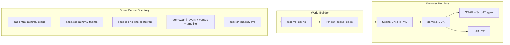

## Architecture



Scroll-scrubbed pinned timeline: a tall hidden spacer drives `gsap.timeline({ scrollTrigger: { scrub, pin } })`. Each `timeline` cue in YAML becomes a tween on the timeline. Verses are auto-rendered into a verses layer; `SplitText` splits each line into words/chars for staggered reveal. Reverse scroll plays the timeline in reverse for free (that's GSAP's default for scrubbed timelines).

**Scene type contract.** A scene becomes a "demo scene" iff its directory contains `demo.yaml`. Only those scenes:

- Have the demo runtime libraries injected (GSAP, ScrollTrigger, SplitText).
- Get `window.__DEMO__` set and `playground/static/sdk/demo.js` + `demo.css` loaded.
- Receive the demo body classes with scroll enabled and the scrollbar hidden.
- Get the slim built-in scroll progress bar (can be disabled per demo with `progress_bar: false`).

All other scenes are completely unaffected — no extra bytes, no extra classes, no extra script tags.

**Hidden scrollbar.** Demo scenes need real document scroll for ScrollTrigger's pin/scrub, but the user must not see a scrollbar. The SDK adds a body class (e.g. `pg-scene--demo`) that:

```css
html, body { scrollbar-width: none; }       /* Firefox */
body::-webkit-scrollbar { display: none; }  /* Chromium / Safari */
```

Wheel, trackpad, touch, arrow keys, PageUp/Down, and Space continue to work — only the visual scrollbar is hidden.

## Library choices and where they land

- `playground/static/vendor/gsap.min.js` — core animation engine
- `playground/static/vendor/ScrollTrigger.min.js` — scroll-driven progress, pin, scrub
- `playground/static/vendor/SplitText.min.js` — split poem lines into words/chars for staggered reveal

Vendored locally (no CDN) so demos work on the Tailscale-only workstation, offline if needed. All three are part of the GSAP family and free since April 2024 (Webflow acquisition). Native scroll only in v1.0; ScrollSmoother can be added in v1.1 if/when a demo needs eased momentum or `data-speed` parallax. See [gsap.com/scroll](https://gsap.com/scroll/).

## New SDK: `playground/static/sdk/demo.js` (+ `demo.css`)

Exposes `window.Demo` with one main entry point:

```js
Demo.run(window.__DEMO__, { onComplete });
```

### Responsibilities (runtime)

- Mount `.demo-stage` (pinned viewport), `.demo-layers`, `.demo-verses`, and the slim `.demo-progress` bar into the scene root.
- For each `layer` in YAML: create the element (``, `<div>`, `<svg>`, `<video>`), apply `initial` props (x, y, scale, rotation, opacity, anchor), register it under its `id`.
- For each `verse`: render into `.demo-verses`, pre-split with `SplitText` (lines/words/chars), keep hidden by default.
- Build a single `gsap.timeline()`, normalize each cue's `at`/`to` (0..1) against the YAML `length`, and dispatch to the right cue handler from the catalogue below.
- Wire it to `ScrollTrigger`: `{ trigger: '.demo-stage', start: 'top top', end: '+=' + length, pin: true, scrub: scrub ?? 1 }`.
- Update the progress bar from `ScrollTrigger.onUpdate`.
- Respect `prefers-reduced-motion`: collapse to end-state, reveal `onComplete` immediately.
- Respect preview mode (`window.__PLAYGROUND__.previewMode`): no event side effects; demo still plays so the admin can preview.
- Refresh ScrollTrigger after images / fonts load and on `resize`.
- Optional `emit_event` cue uses the existing tracker, gated by preview mode.

### Cue catalogue (the YAML "language")

Each cue has `target` (layer id or verse id), `at` (start 0..1), `to` (end 0..1, defaults to `at`), `kind`, optional `ease`, optional `device: all | desktop | mobile` (default `all`), and kind-specific options. v1.0 ships a **deliberately minimal** set that covers appearing, disappearing, moving, zooming, fading, layering, and timeline structuring. New kinds are easy to add later (the dispatcher is a lookup table), so we stay conservative.

| Kind | Options | Effect |
|------|---------|--------|
| `set` | `props: { x, y, scale, opacity, rotation, z }` | Instantly set props at `at` (no animation). `z` lets a layer come forward / go back mid-timeline. |
| `show` | `from: up\|down\|left\|right\|none` (default `none`); for verses: `text_reveal: words\|chars`, `stagger` | Appear: opacity 0→1 (+ optional slide-in). For verses with `text_reveal`, words/chars stagger in. |
| `hide` | `to: up\|down\|left\|right\|none` (default `none`) | Disappear: opacity 1→0 (+ optional slide-out). |
| `move` | `props: { x, y }` | Animate position to target between `at` and `to`. Accepts `vw`, `vh`, `%`, `px`. |
| `zoom` | `props: { scale }` | Animate `scale` between `at` and `to`. |
| `fade` | `props: { opacity }` | Animate `opacity` between `at` and `to`. |
| `pause` | none | Hold timeline at `at` for `to - at`. Useful spacer between beats. |

All cue kinds accept an `ease:` override; otherwise the demo-level `default_ease` (or `power2.inOut`) applies. All cue kinds accept `device:` to scope them to desktop or mobile only (see "Mobile / responsive" below).

**Layer-level features (not cues):**

- `z: <int>` — static stacking order (higher = on top). The `set` cue can also change `z` mid-timeline.
- `parallax` — continuous scroll-driven translation, composes with cues without conflict. Two equivalent shapes:

  ```yaml
  parallax: 0.5                  # shorthand, y-axis only
  parallax: { y: 0.5, x: -0.2 }  # explicit, two axes
  ```

  Factor semantics: `1.0` = layer scrolls in lockstep with content; `0.5` = half speed (feels distant / background); `1.5` = faster than content (feels closer / foreground); **negative** = layer drifts against scroll direction. This single primitive covers classic depth parallax, foreground "fly-past" effects, and counter-drift gimmicks.

  **Composition with cues:** parallax applies a base transform to a wrapper around the layer; cues animate properties on the inner element. The two transforms stack independently, so a layer can simultaneously drift up at half speed (parallax) and zoom + move on cue.

Things deliberately **not** in v1: `typewriter`, `pulse`, `shake`, `glow`, `blur`, `color`, `stage_zoom`, `stage_pan`, `label`, `emit_event`, `from`, generic `animate`. Each can land as a one-function addition in v1.x if a real demo needs it. The cue dispatcher is a lookup table, so the cost of adding a kind is small — but every kind we ship is a forever-commitment for backward compatibility, so we keep v1 minimal.

### Layer features

- `type: image | div | svg | text` (`video` is reserved for v1.1)
  - **`image`** — renders ``; use the `src:` field.
  - **`div`** — renders a `<div>` with arbitrary `html:` inside (paragraphs, headings, lists, mixed markup). Lets you have a styled box containing a `<p>` or any custom HTML, and animate the box as a unit.
  - **`svg`** — inline `<svg>...</svg>` from the `html:` field.
  - **`text`** — shortcut for a single styled text overlay (rendered as a `<p>` under the hood). Use the `text:` field instead of `html:`.
- `src`, `html`, `text`, `class`, `style` — content/attribute fields, per type
- `z: <int>` — static stacking order (higher = on top). Can be re-set mid-timeline with a `set` cue.
- `anchor: top-left | top | top-right | left | center | right | bottom-left | bottom | bottom-right` (default `center`)
- `initial: { x, y, scale, rotation, opacity, z }` — `x`/`y` accept `px`, `%`, or viewport units (`vw`/`vh`); prefer `vw`/`vh`/`%` for mobile-friendly layouts
- `parallax` — see catalogue section above; accepts `<factor>` (y-axis shorthand) or `{ y, x }` (explicit). Factor semantics: 1.0 = lockstep, <1.0 = slower/background, >1.0 = faster/foreground, negative = counter-drift.

### Cue target resolution

A cue's `target:` accepts three forms:

1. **Layer id** — `target: gaia` matches the layer with that id; SDK resolves it to the layer's animated element.
2. **Verse id** — `target: v1` matches a verse declared under `verses:`.
3. **CSS selector** — `target: "#btn-continue"` or `target: ".my-class"` (must start with `#` or `.`). Resolved against the scene root, so the scene's own static HTML (a button declared in `base.html`, etc.) can participate in the demo. Useful for things like revealing a "Continue" button when the timeline completes.

Cues animate the **whole** matched element. Sub-element targeting (e.g. "the third word inside this div") is not supported in v1 — use separate layers or use `verses` with `text_reveal: words|chars` for staggered text.

### Verse features

- `text: "..."`
- `style: title | poem | caption | none` (controls font, size, weight, max-width — all responsive via `clamp()`)
- `position: top | center | bottom | { x, y }`
- Default visibility is hidden; a `show` cue reveals it.

### Demo-level options

```yaml
length: 2400              # virtual scroll length in px
scrub: 1                  # ScrollTrigger scrub (true | number)
pin: true                 # pin the stage during the scroll range
default_ease: power2.inOut
progress_bar: true        # slim 2px bar at top showing scroll progress
background:               # optional background on .demo-stage
  type: gradient
  value: "radial-gradient(ellipse at top, #2a2340, #08060c)"
```

### Mobile / responsive

Three complementary mechanisms, all authored in the same `demo.yaml`:

1. **Responsive units everywhere.** All position/scale fields accept `%`, `vw`, `vh` in addition to `px`. Demos that position layers with these units adapt to any viewport for free (this handles the majority of real cases). The `clamp()`-based typography in `demo.css` does the same for verses.

2. **Per-cue `device:` field.** Any cue can be scoped to a device class: `device: all | desktop | mobile` (default `all`). The SDK filters cues at load (and on breakpoint cross) so the inactive ones never enter the timeline. Best when most cues are shared but a few (e.g. movement direction) differ:

   ```yaml
   timeline:
     - { target: gaia, at: 0.1, to: 0.3, kind: show }                                       # both
     - { target: gaia, at: 0.3, to: 0.7, kind: move, props: { x: "30%" }, device: desktop } # landscape: slide right
     - { target: gaia, at: 0.3, to: 0.7, kind: move, props: { y: "30%" }, device: mobile  } # portrait: slide down
   ```

3. **`mobile:` override block.** For non-timeline fields (a layer in a different spot on portrait, shorter scroll, smaller initial scale), add a `mobile:` section. At load and on resize, the SDK checks `matchMedia('(max-width: <max_width>)')` and, when it matches, deep-merges the override over the base config, then calls `ScrollTrigger.refresh()`. The `mobile:` block may also include `timeline:` — when present, **it fully replaces** the desktop timeline (use this when desktop and mobile choreographies are fundamentally different and `device:` tagging would mean labelling every cue).

```yaml
length: 2400
layers:
  - id: gaia
    type: image
    src: assets/gaia.svg
    initial: { x: "50%", y: "55%", scale: 0.6 }
  - id: planet
    type: image
    src: assets/planet.svg
    initial: { x: "120%", y: "55%", scale: 0.4 }
    parallax: 0.6                      # drifts slower than the scroll (depth)

mobile:
  max_width: 768                       # apply when viewport.width <= 768
  length: 1800                         # shorter scroll on phones
  layers:
    gaia:
      initial: { scale: 0.5, y: "50%" }
    planet:
      initial: { x: "100%", y: "60%" }
      parallax: 0.4                    # even slower on portrait
  # Optional: mobile.timeline: [...] fully replaces the desktop timeline.
```

What `mobile:` can override in v1: `length`, `scrub`, `pin`, `default_ease`, `background`, `progress_bar`, any field inside `layers.<id>` (deep merge, including `parallax`), and the full `timeline:` (replacement, not merge).

**Pick the right tool:**

- Same choreography, slightly different sizes → just **responsive units**.
- Same beats, a few cues differ per device → **`device:` per cue**.
- Genuinely different choreography on portrait → **`mobile.timeline:`** (full replacement).

### `demo.yaml` minimal example (test fixture)

This is the file under `tests/fixtures/` that the test suite renders to confirm the SDK + render injection work end-to-end. **Not user-facing.**

```yaml
length: 1200
scrub: 1
pin: true
default_ease: power2.inOut

layers:
  - id: a                                                               # div with inner HTML
    type: div
    class: fixture-a
    html: "<p>Box A with a <strong>paragraph</strong> inside.</p>"
    z: 2
    initial: { x: "50%", y: "50%", scale: 0.5, opacity: 0 }
  - id: b                                                               # plain div
    type: div
    class: fixture-b
    z: 1
    initial: { x: "-100%", y: "50%", opacity: 1 }
    parallax: { y: 0.4, x: 0.1 }                                        # both-axis parallax
  - id: caption                                                         # text shortcut
    type: text
    text: "A small caption."
    class: fixture-caption
    initial: { y: "80%", opacity: 0 }

verses:
  - { id: v1, text: "Hello, world.", style: title }

timeline:
  - { target: a,  at: 0.00, to: 0.20, kind: show }
  - { target: v1, at: 0.05, to: 0.25, kind: show, text_reveal: words, stagger: 0.05 }
  - { target: a,  at: 0.25, to: 0.30, kind: set, props: { z: 5 } }      # z-index change mid-timeline
  - { target: a,  at: 0.30, to: 0.55, kind: zoom, props: { scale: 1.2 } }
  - { target: b,  at: 0.40, to: 0.80, kind: move, props: { x: "50%" }, device: desktop } # device filter
  - { target: b,  at: 0.40, to: 0.80, kind: move, props: { y: "20%" }, device: mobile  }
  - { target: caption,        at: 0.50, to: 0.70, kind: show }          # text-type layer
  - { target: "#fixture-cta", at: 0.65, to: 0.80, kind: show }          # CSS-selector target (element from scene HTML)
  - { target: a,  at: 0.70, to: 0.75, kind: pause }
  - { target: a,  at: 0.75, to: 0.85, kind: fade, props: { opacity: 0.3 } }
  - { target: v1, at: 0.80, to: 0.95, kind: hide }
  - { target: a,  at: 0.85, to: 1.00, kind: hide }

mobile:
  max_width: 768
  length: 900
  layers:
    a: { initial: { scale: 0.4 } }
    b: { parallax: 0.2 }                                                # weaker parallax on phones
```

Every v1 cue kind appears at least once, plus `z` change, two-axis parallax, single-axis parallax, the `device:` filter, the `mobile:` overrides, all three layer types (`div` with inner `<p>`, `text`, and a CSS-selector target into the fixture's `base.html`) — so the test can assert each dispatcher branch and the resolver are hit.

## World Builder changes

Two minimal changes, both additive and **gated by `demo.yaml` presence** (existing scenes completely unaffected):

- [playground/services/world_builder/service.py](playground/services/world_builder/service.py) — in `load_scene_files` (or a sibling `load_scene_demo`), look for `<scene>/demo.yaml`. If present, parse it and attach to the resolved spec (extend `SceneResolved` with optional `demo_config`). If absent, return `None` and the rest of the pipeline behaves exactly as today.
- [playground/services/world_builder/render.py](playground/services/world_builder/render.py) — **only when `resolved.demo_config` is set**:
  - Inject `<link rel="stylesheet" href="/static/sdk/demo.css">`.
  - Inject `<script src="/static/vendor/gsap.min.js">` plus `ScrollTrigger` and `SplitText`.
  - Inject `<script src="/static/sdk/demo.js">`.
  - Set `window.__DEMO__ = <config>` alongside `window.__PLAYGROUND__`.
  - Add the `pg-scene--scroll` + `pg-scene--demo` body classes (demo scenes need real scroll for the pin/scrub pattern; the demo class hides the scrollbar via CSS).
- **A/B for demos is out of scope in v1** (see "Out of scope" below). No changes to [playground/services/world_builder/patcher.py](playground/services/world_builder/patcher.py).

Static assets (`assets/*` per scene) get a route in [playground/main.py](playground/main.py) (or via the existing `worlds_content` mount) so `` resolves to `/worlds_content/intro_world/scenes/demo/assets/gaia.svg`. Check if there is already a worlds-content static mount; if not, add one scoped to that directory.

## Existing `intro_world/scenes/demo` scene

The placeholder scene created in the previous turn (HTML/CSS/JS that just shows "Demo" and continues to map) stays as-is for v1.0. It does **not** have a `demo.yaml`, so it is not treated as an SDK demo and is unaffected by any of the SDK changes. You can convert it to an SDK-driven demo later by dropping in a `demo.yaml` and trimming the existing `base.{html,css,js}` to a minimal bootstrap.

## Test fixture (not user-facing)

A tiny `demo.yaml` lives under `tests/fixtures/demo_smoke/` (with whatever scaffold the test needs to invoke the world_builder — a stub `world.yaml`/`scene.yaml` if required). No assets, no styling beyond two colored `<div>` boxes. It exercises **every v1 cue kind, both parallax shapes (number + object), per-cue `device:` filter, mid-timeline `z` change, and the `mobile:` block (including a `mobile.layers.<id>.parallax` override)** so the regression test can render it and assert:

- The right scripts/styles are injected.
- `window.__DEMO__` contains the parsed config.
- Each cue kind reaches the cue-handler dispatch table (verified via a counter the SDK exposes on `window.Demo.__debug` when present).
- Mobile override merge produces the expected resolved config when the viewport matches `max_width` (including layer-level parallax overrides).
- `device:` filtering removes the right cues from the active timeline on each device class.

This fixture exists for tests only — it is **never linked into any world**, never visible to users.

## Tests

- New `tests/test_demo_framework.py`:
  - **YAML loader:** parses the fixture, validates required fields, rejects unknown cue kinds with a clear error, and accepts both parallax shapes (number, object).
  - **Mobile merge:** given the fixture's `mobile:` block, asserts the deep-merge result (length, layer overrides including parallax) matches the expected resolved config.
  - **Device filter:** asserts that filtering the fixture timeline with `device=desktop` and `device=mobile` keeps the right cues (the all-default cues plus the matching device-tagged ones).
  - **`mobile.timeline:` replacement:** a separate small fixture asserts that a `mobile:` block containing `timeline:` fully replaces the desktop timeline rather than merging.
  - **Render injection (on):** a scene with `demo.yaml` gets the demo body classes, vendor + sdk script tags, and a `window.__DEMO__` config.
  - **Render injection (off, regression guard):** a scene without `demo.yaml` renders **byte-identical HTML to today** (no vendor scripts, no `__DEMO__`, no demo body class).
  - **Cue catalogue contract:** a Python-side schema enum (mirrored in `ai_docs/services/demo_framework.md`) covers exactly the kinds the SDK implements — a test asserts they match so docs and code can't drift.
- [tests/test_intro_flow.py](tests/test_intro_flow.py) — unchanged for v1.0 (the existing `demo` scene has no `demo.yaml`, so the current assertions still hold).

## Documentation + new agent role

### AI helpers

- New `ai_docs/services/demo_framework.md` — **the SDK's contract**. Full schema reference, every cue kind with parameter table and a 3-line example, the layer/verse/demo option tables (including the three layer types `image`/`div`/`svg`/`text` and the three target forms — layer id, verse id, CSS selector), the parallax composition rules (depth, foreground fly-past, counter-drift, two-axis), the `mobile:` override rules + the per-cue `device:` field, and a "Cookbook" section with copy-pasteable snippets for common effects (entrance, exit, move A→B, zoom, fade, classic depth parallax, layered scene with z-changes mid-timeline, animating a `<button>` from `base.html` via a CSS-selector target, mobile overrides + device-specific cues). Written so an AI agent can author a complete demo from this file alone, without reading the source.
- Update `ai_docs/services/world_builder.md` — note the `demo.yaml` extension and the type contract (presence of `demo.yaml` = demo scene).

### New agent role: `demo_builder`

New file `ai_docs/roles/demo_builder.md`, following the same shape as the existing role files in `ai_docs/roles/` (e.g. `scene_ui_designer.md`, `tester.md`). The role exists to turn a human (or product manager) idea — "a demo where Gaia sings and the planet rises" — into a complete, working `demo.yaml`. The file must include:

- **When to activate.** Triggered when a task is "design / build / extend a demo for a scene." Not for adding the SDK itself (that's `developer`) and not for non-demo scene reskins (that's `scene_ui_designer`).
- **Mandatory reading before acting** (this is the project's convention; cite both with relative links):
  - `ai_docs/services/demo_framework.md` — full schema and cookbook
  - `ai_docs/services/world_builder.md` — how scenes/versions are resolved and how `demo.yaml` plugs in
  - `ai_docs/conventions/coding.md` — the project's general code/style rules
  - The current scene directory's existing `base.html`, `base.css`, `base.js` (so it understands what static HTML / CSS hooks / Continue buttons already exist and can reference them via CSS-selector targets).
- **Authoring workflow** (the role's "how I work"):
  1. Restate the demo idea in one paragraph: subject, beats, mood, target devices.
  2. Sketch a 3–5 beat storyboard with timeline percentages (e.g. "0.00–0.30 setup; 0.30–0.70 transformation; 0.70–1.00 reveal").
  3. List required layers (id, type, asset or HTML, anchor, initial state). Mark which are decorative (parallax-only) vs cued.
  4. List verses (if any) with positions and reveal style.
  5. Draft the `timeline:` cue-by-cue, preferring `vw`/`vh`/`%` units and the demo-level `default_ease`.
  6. Add layer-level `parallax` for depth where appropriate.
  7. Add a `mobile:` block (overrides + optional per-cue `device:` filters) covering portrait viewports.
  8. Validate the YAML against the cue catalogue table in `demo_framework.md` — no unknown kinds, no targets that don't resolve, every cue has `at`/`to` in 0..1.
- **Output contract.** The role produces:
  - `playground/worlds_content/<world>/scenes/<scene>/demo.yaml` (required)
  - Optional asset files under that scene's `assets/` directory (if it commits art; otherwise stubs the `src:` paths and asks the user to drop files).
  - A minimal `base.html` / `base.css` / `base.js` if the scene is brand new (with `base.js` being a small `Demo.run(window.__DEMO__)` + Continue handler bootstrap).
- **Hand-offs.**
  - To `ethics_reviewer` if the demo content is user-visible and shipping live (per the project's ethics gate in `.cursorrules`).
  - To `tester` once the YAML is in place, for the standard player-flow walk.
  - To `scene_ui_designer` if the demo needs significant custom CSS beyond what the SDK provides (e.g. a unique typeface for verses).
  - Back to `developer` if a needed cue kind doesn't exist yet — never invent kinds; request them.
- **Hard "do not" rules.**
  - Do not invent cue kinds, layer types, or options that aren't in `demo_framework.md`.
  - Do not edit `playground/static/sdk/demo.js` or `demo.css` — those are the developer's surface.
  - Do not skip the `mobile:` block; if you don't add it, justify in a comment why responsive units alone are enough.
  - Do not put real user-visible copy live without ethics review when the demo is part of an experiment.

Also register the new role in `ai_docs/README.md`'s role list/routing table so the product_manager can route to it.

### Human-facing docs

- Update [docs/Architecture.md](docs/Architecture.md) — add a "Demo SDK" subsection.
- Update `docs/tech-stack.html` — add a Demo SDK row (GSAP / ScrollTrigger / SplitText).
- Update [README.md](README.md) — one line under "What's in this repo" about the Demo SDK.

## Out of scope (call out, not done now)

- **Authoring any real demo scene.** v1 ships only the SDK and the test fixture. Real demos (intro Gaia/planet, etc.) come later, authored by humans or AI agents using the schema.
- **A/B testing for demos** — phase 2. Every demo scene has exactly one variant for now (its `demo.yaml`). Existing A/B on non-demo scenes (e.g. `consent` arms `trust`/`playful`) is untouched.
- **ScrollSmoother** — not in v1.0. Add in v1.1 if a demo needs eased momentum or `data-speed` parallax; the SDK already exposes a layer-level `parallax` cue using plain scroll progress, which is enough for most cases.
- **Visual timeline editor** (Theatre.js) — phase 3, not now.
- **Multi-axis scroll / horizontal storytelling** — single vertical scrub only in v1.
- **Sound** — could be a later cue kind: `play_sound`.
- **Video layers** — `type: video` is in the schema but not implemented in v1.0; documented as "v1.1".

## Risks / gotchas

- The default scene shell uses `overflow: hidden`; the SDK must force `pg-scene--scroll` + `pg-scene--demo` (and handle the preview banner's top padding so the pinned stage doesn't shift).
- Hiding the scrollbar with CSS keeps wheel/touch/keys working, but **`overflow: hidden` on `<body>` would break scrolling entirely** — the demo body class must keep overflow scrollable while hiding the bar.
- ScrollTrigger's `pin` measures heights on load; if assets load late, call `ScrollTrigger.refresh()` once images / fonts finish loading. SDK does this automatically. It also calls `refresh()` when the mobile breakpoint is crossed so layouts recalc after the `mobile:` overrides apply.
- GSAP minified bundle (~50 KB) + ScrollTrigger (~40 KB) + SplitText (~10 KB) only loads on scenes that have `demo.yaml` — no cost for other scenes.
- The cue catalogue is the SDK's public API. If a kind ships, removing it later is a breaking change for any demo using it; favour additive evolution.
- Workstation NTFS quirks discussed earlier do not affect static asset serving.