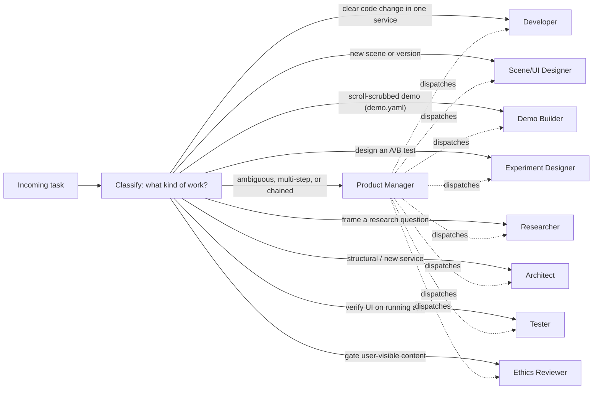

# AI helper hub

This folder is the **AI-facing operational manual** for the Marketing for Betterment playground. Every AI agent working in this repository reads this file first — it describes the structure, lists what else exists, and shows you how to route to the docs you actually need.

Human-facing docs live in [`/docs/`](../docs/). Both trees must move together when behavior changes (see the update rule below).

## Read order

You are not assigned a role on entry. You are an agent with a task. Walk this order:

1. **This file** — to understand the structure of `ai_docs/` and find the right next file.
2. **The relevant conventions** in [`conventions/`](conventions/) — coding, documentation, testing rules that apply regardless of task.
3. **The matching role file(s)** in [`roles/`](roles/) — these define the operating checklist for the kind of work you are doing.
4. **The matching service helper(s)** in [`services/`](services/) — concrete cookbook + reference for the service you are touching.

Most tasks need one role and one service. Multi-step tasks (e.g. design a new variant, ship it, verify, ethics-review it) chain through several roles.

## Classify the task, then pick role(s)

A direct task (e.g. "fix this bug in `admin/router.py`") goes straight to Developer; the PM role is only needed when work has to be orchestrated across roles or the request is ambiguous.

## Role index

| Role | When to read its file |
|---|---|
| Product Manager | Ambiguous, multi-step, or multi-role requests; you need to chain specialists. [`roles/product_manager.md`](roles/product_manager.md) |
| Architect | New service, schema change, cross-service refactor, `ai_docs/` structure change. [`roles/architect.md`](roles/architect.md) |
| Developer | Any code change inside an existing service. [`roles/developer.md`](roles/developer.md) |
| Scene/UI Designer | New scene HTML/CSS/JS or new scene version. [`roles/scene_ui_designer.md`](roles/scene_ui_designer.md) |
| Demo Builder | Author or extend a scroll-scrubbed demo (`demo.yaml`). [`roles/demo_builder.md`](roles/demo_builder.md) |
| Experiment Designer | New A/B test, arm, schedule, or explanation. [`roles/experiment_designer.md`](roles/experiment_designer.md) |
| Researcher | Framing what we measure before any variant is designed. [`roles/researcher.md`](roles/researcher.md) |
| Ethics Reviewer | Gate before any new world / scene / experiment goes live. [`roles/ethics_reviewer.md`](roles/ethics_reviewer.md) |
| Tester | End-to-end UI verification on the running app. [`roles/tester.md`](roles/tester.md) |

Role files share a 5-section template — see [`conventions/documentation.md`](conventions/documentation.md).

## Service index

| You are changing… | Read first |
|---|---|
| A world, scene, or scene version | [`services/world_builder.md`](services/world_builder.md) |
| A scroll-scrubbed demo scene (`demo.yaml`) | [`services/demo_framework.md`](services/demo_framework.md) + [`services/world_builder.md`](services/world_builder.md) |
| Event firing, scene event bindings, the JS SDK | [`services/event_tracker.md`](services/event_tracker.md) |
| An experiment, arms, schedule, lifecycle | [`services/ab_testing.md`](services/ab_testing.md) |
| Identity, return codes, sessions, consent | [`services/identity.md`](services/identity.md) |
| Player state KV | [`services/player_state.md`](services/player_state.md) |
| Admin UI, Jinja templates, filters, preview routes | [`services/admin.md`](services/admin.md) |

## Conventions

- [`conventions/coding.md`](conventions/coding.md) — Python, FastAPI, JS SDK, datetime, preview-mode contract.
- [`conventions/documentation.md`](conventions/documentation.md) — `/docs/` vs `ai_docs/` boundary, update rule, role-file template, pairing table.
- [`conventions/testing.md`](conventions/testing.md) — pytest fixtures, where tests live, how to run.

## Other files in this folder

- [`workstation_info.md`](workstation_info.md) — environment notes (venv path, default DB path, etc.). Read when a task involves running the dev server or pytest and the standard paths in `conventions/testing.md` don't match what's on disk.

## Legacy reference site (repo root)

The original static **Wonderful World of Manipulative Marketing** site lives at [`legacy/`](../legacy/) (source: [github.com/ebzgr/wwmm](https://github.com/ebzgr/wwmm)). Use it as a **read-only reference** when porting HTML/CSS/JS into `playground/worlds_content/` scenes — do not serve it from the FastAPI app.

| Legacy page | Typical playground target |
|---|---|
| `legacy/index.html` | [`map_world`](../playground/worlds_content/map_world/): `welcome`, `map`, six `door_*` scenes (click navigation vs scroll) |
| `legacy/urgency-world.html` | future `urgency_world` scenes |
| `legacy/reward-world.html` | future `reward_world` scenes |
| `legacy/social-world.html` | future `social_world` scenes |
| `legacy/deal-world.html` | [`playground/worlds_content/deal_world/`](../playground/worlds_content/deal_world/) |
| `legacy/framing-world.html` | future framing world scenes |
| `legacy/persuasion-world.html` | future persuasion world scenes |
| `legacy/about.html`, `legacy/join-us.html`, `legacy/studio.html` | reference only unless explicitly requested |

Assets: `legacy/assets/css/`, `legacy/assets/js/`, `legacy/assets/img/`, `legacy/assets/sound/`, `legacy/assets/music/`. When porting, copy only what a scene needs into `worlds_content` or `playground/static/` and fix asset paths — the legacy site uses relative paths from repo root.

## The update rule (also embedded in `.cursorrules` and `conventions/documentation.md`)

> When you change behavior, file layout, public interface, or conventions of a service, you MUST update its `ai_docs/services/<service>.md` in the same change. Update `ai_docs/conventions/*.md` when the rule itself changes. Update `ai_docs/roles/<role>.md` when a role's triggers, required reading, or hand-off changes. Stale AI helpers are treated as an incomplete task — same standard as `/docs/`.

## When no role fits cleanly

Activate the **Product Manager** role, restate the task, and ask one focused clarifying question before doing anything else. Do not invent a path the routing table does not endorse.

## Mission context (one paragraph)

The playground is a research and awareness platform that makes manipulative marketing visible through immersive, art-driven Worlds, and provides scientific infrastructure to study how those techniques work and how awareness can reduce their effectiveness. All research is conducted through the lens of consumer, societal, and planetary well-being — never for profit-style optimization. See [`/docs/conceptual.html`](../docs/conceptual.html), [`/docs/ethics.html`](../docs/ethics.html), and [`/docs/research-methodology.html`](../docs/research-methodology.html) for the full framing.
