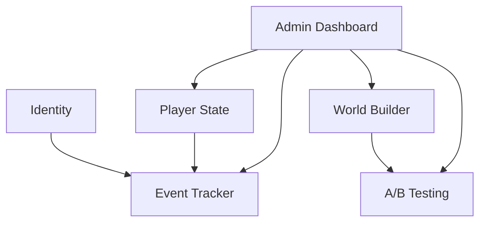

# Playground v0 — System Architecture

This document describes the **implemented** backend skeleton (Python / FastAPI). It supersedes earlier draft ideas (LOLA, separate static-bundle hosts) until those are built.

## Stack

| Layer | Choice |
|-------|--------|
| API | FastAPI + Uvicorn |
| ORM | SQLAlchemy 2 (async) + aiosqlite |
| DB | SQLite (default `/tmp/eden_playground.db`; override via `DATABASE_URL`) |
| Validation | Pydantic v2 |
| Admin UI | Jinja2 templates |
| Worlds UI | Vanilla HTML/CSS/JS + `tracker.js` SDK; Demo SDK (`demo.yaml` + GSAP) for scroll-scrubbed demos |
| Migrations | Alembic |

## Services (one process)



### Identity

- `POST /identity` — mint or validate browser `return_code`; server stores only `hash(return_code)`.
- `POST /consent` — `granted` / `denied` before events are stored.
- `DELETE /me` — erasure for the current return code.

Sessions are **per-world entry**: reload keeps `session_id`; leaving a world and returning mints a new session.

### Event Tracker

- `POST /events` — batched append-only ingest (requires consent). Preview requests
  (`X-Playground-Preview: 1` or `preview-*` session ids) return `accepted: 0`.
- Client SDK (loaded on every scene):
  - [`playground/static/sdk/tracker.js`](../playground/static/sdk/tracker.js) — queue, batch flush, `sendImmediate` for unload.
  - [`playground/static/sdk/events.js`](../playground/static/sdk/events.js) — auto lifecycle + declarative bindings.
  - [`playground/static/sdk/playground.js`](../playground/static/sdk/playground.js) — identity, sessions, `Playground.track()`.

**Event naming** — `{scope}_{verb}` in snake_case. Do not prefix with scene id
(the `scene_id` column already scopes queries).

| Kind | Examples |
|------|----------|
| Auto (SDK) | `scene_view`, `scene_exit` |
| Declarative (HTML) | `consent_toggled`, `lab_continue_clicked` |
| Imperative (JS) | `consent_granted`, `cta_clicked`, `question_answered` |

**Auto-attached on every event** (top-level columns + payload merge for experiment):

- `world_id`, `scene_id`, `scene_version_id`, `experiment_arms`, `ts_client`
- Payload may also include `experiment_id`, `arm_id`, `assignment_scope` when in an A/B test

**Declarative events** — no scene JS required:

```html
<button data-pg-event="cta_clicked">Buy</button>
<input type="checkbox" data-pg-event="consent_toggled"
       data-pg-payload='{"surface":"intro"}'/>
```

**Imperative events** — when logic gates the event:

```js
Playground.track("consent_granted", { via: "intro_consent_scene" });
```

**Auto lifecycle** — after `Playground.initTracker()`:

- `scene_view` on load (`entered_from` when navigating from another scene)
- `scene_exit` on tab hide, unload, or `Playground.goToScene()` (`duration_ms`, `reason`)

Debug: add `?pg_debug=1` to log every event to the console.

### World Builder

- Worlds/scenes live under `playground/worlds_content/<world_id>/`.
- Each scene: `base.html`, `base.css`, `base.js`, plus optional `versions/`.
- A version is exactly **one file**: `versions/<name>.yaml`. The filename
  *is* the version name (referenced by A/B experiment arms). Drop the `id:`
  field in the manifest; it defaults to the filename stem.
- Manifest fields (all optional):
  - `description` — free text
  - `html` / `css` / `js` — full replacements for the scene's base files
  - `css_append` / `js_append` — strings appended after the resolved css/js
  - `patches` — list of DOM ops applied to the resolved HTML
  - `nav_overrides` — `{event: next_scene}` merged into the scene's nav
- Patch ops (CSS selectors, lxml-backed):
  `setText`, `setHtml`, `setAttr`, `removeAttr`, `addClass`, `removeClass`,
  `appendInside`, `prependInside`, `insertBefore`, `insertAfter`, `remove`.
- Pick the right tool per change:
  - **Surgical tweak** → `patches` + `css_append` (see `urgent.yaml`).
  - **Full reskin** → `html` + `css` multiline blocks (see `sky.yaml`).
  - **Hybrid** → combine `html`/`css` with `patches`; patches apply *after*
    the full replacement.
- Preview any version directly: `?force_version=<name>` on the `/view` URL.
- `GET /worlds/{world}/scenes/{scene}` — resolved content + nav map.
- `POST .../transition` — next scene (default navigation only; no A/B on transitions).

Example — surgical tweak (`versions/urgent.yaml`):

```yaml
description: Red urgency CTA.
patches:
  - { op: setText,  selector: "#cta", value: "Last chance!" }
  - { op: addClass, selector: "#cta", value: "cta-urgent" }
css_append: |
  .cta-urgent { background: #c0392b; color: #fff; }
```

Example — full reskin (`versions/sky.yaml`):

```yaml
description: Daylight reskin.
html: |
  <main class="sky-realm">...</main>
css: |
  body { background: linear-gradient(180deg, #a4d4ff, #f6ecd6); }
```

A/B arms reference versions by filename. **Any number of arms** is supported;
weights are proportional (e.g. three arms with `weight: 1` each ≈ 33% each):

```yaml
arms:
  - { id: control, version: base,   weight: 50 }
  - { id: variant, version: urgent, weight: 50 }
```

Three-way example (equal weights on `intro_world` / `consent` — `base`, `trust`, `playful`):

```yaml
arms:
  - { id: base,    version: base,    weight: 1 }
  - { id: trust,   version: trust,   weight: 1 }
  - { id: playful, version: playful, weight: 1 }
```

### Intro player journey

Default path: **`/` → `intro_world/lab` → `consent` → `demo` → `map_world/welcome`**.

- `demo` is a scroll-scrubbed **Gaia letter** demo in `intro_world/scenes/demo/` (`demo.yaml` + minimal bootstrap HTML/CSS/JS); consent navigates here before the map.
- `demo` continues to `map_world/welcome` via scene JS (`PG.goToScene`) after the poem finishes.

### Demo SDK

Scroll-scrubbed narrative demos are authored with **`demo.yaml`** in a scene directory (see [`ai_docs/services/demo_framework.md`](../ai_docs/services/demo_framework.md)). When present:

- The page shell injects GSAP, ScrollTrigger, `demo.js`, and `window.__DEMO__`.
- Scroll drives a pinned timeline forward; scrolling up reverses it.
- The scrollbar is hidden; a slim progress bar shows scroll progress.
- Layers (`image`, `div`, `text`, `svg`), verses, parallax, and mobile overrides are declared in YAML.

The intro `demo` scene is a YAML-driven scroll poem (“letter from Mother Gaia”) with word-by-word couplet reveals. The smoke test fixture lives under `_fixtures/smoke`.

### Intro consent variants

`intro_world/consent` ships three copy variants:

- `base` — short, neutral, with a "Read more" link to `intro_world/about`.
- `trust` — AI-designed for higher trust (specific privacy reassurances, calmer colors).
- `playful` — light/funny tone that acknowledges the meta-irony of an A/B test on a marketing-awareness study.

The `intro_world/about` scene is **public** (no consent required) and explains the
research purpose and data handling without naming the experience.

### A/B Testing

Scene **version** experiments only (navigation transitions are not A/B tested).

Each experiment has:

- **id** — stable technical key you choose (or auto-derived as `exp_…` from the name); used in APIs, assignments, and events. Unlike users, this is **not** a random UUID.
- **name** — human-readable label for the admin UI
- **starts_at** / **ends_at** — schedule window (UTC)
- **explanation** — single long-form description for researchers/admins
- **state** — `draft` | `live` | `paused` | `done`
- **assignment_scope** — `user` (sticky, persisted) | `session` (recomputed per world entry)

When `ends_at` passes, live/paused experiments are auto-marked **done** (on admin list load and at assignment time). Admins can **extend** the end date; all status and schedule changes are logged in `experiment_status_history` with timestamps.

Assignment: seeded-random over weighted arms (`blake2b(subject + experiment_id)`).

### Player State

KV per user: `GET/POST/PATCH /state/{key}` with ops `append`, `remove`, `set`, `inc`, `merge`.

Every mutation auto-emits a `state_changed` event in the same DB transaction.

Example keys: `journey.orbs`, `deal_world.loyalty`, `journey.completed_worlds`.

### Admin Dashboard

`/admin/` — Jinja + **Bootstrap 5 (CDN)** + **Chart.js** (CDN). Player worlds keep their own CSS.

Shared **server-side pagination** (`playground/services/admin/pagination.py`): `page`, `page_size` (max 100), `COUNT` + `LIMIT`/`OFFSET` on Events, Users, and Experiments list routes.

- **Events:** filters + paginated table + filtered CSV export; daily events chart (30d) with optional `trend_event_type` (respects table filters).
- **Users:** filters (created date, consent) + paginated table; daily new-users chart (30d).
- **Experiments:** filters (state, assignment, world) + paginated table; detail page with explanation, extend, status actions, and audit history.

Also: experiment create/detail, worlds list (card grid + per-world scene/version browser with admin preview), user state inspector.

**Admin preview** (`/admin/worlds/…/preview`) sets `previewMode: true` in `window.__PLAYGROUND__`. The shared SDK (`playground.js`, `tracker.js`) skips events, consent writes, and identity side effects; the API also ignores ingest when `X-Playground-Preview: 1` is sent. Real users use `/worlds/…/view` without preview mode.

Scene scripts should call `Playground.track(type, payload)` so experiment id, arm id, and version are attached automatically.

## Run

See [playground/README.md](../playground/README.md).

```bash
uvicorn playground.main:app --reload --port 8000
```

Sample scene: http://localhost:8000/worlds/deal_world/scenes/intro/view

## Deferred (v1+)

- Email magic-link return flow
- Guardrail metrics / auto stop-loss
- Declarative rule engine for state updates
- Postgres, Docker, charts, audit log, retention jobs
